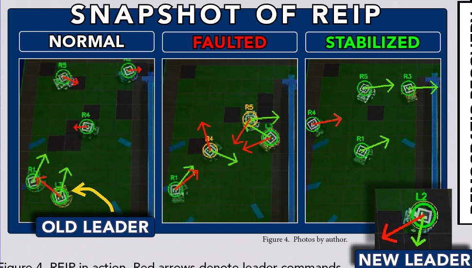

# REIP: Resilient Election and Impeachment Policy

Trust-based governance for multi-robot exploration: follower robots verify every leader command against local evidence *before executing it*, accumulate confidence-weighted suspicion, and democratically impeach and replace a compromised leader.



*Hardware trial sequence: (left) normal leader-follower exploration; (center) the leader is compromised and issues conflicting commands; (right) the team impeaches it, elects a new leader, and the mission stabilizes.*

This repository contains the complete simulation harness, hardware software stack, raw experiment data, and analysis scripts for the paper:

> **Proactive Trust-Based Detection and Impeachment of Compromised Leaders in Multi-Robot Exploration**
> W. R. Kollmyer. Submitted to the IEEE MIT Undergraduate Research Technology Conference (URTC), 2026.

## Key Results

- **Fault-invariant coverage.** Across N=100 simulation trials per condition, REIP holds 100% median coverage under clean, Byzantine bad-leader, and freeze-leader conditions (median resilience gap 0.0 pp). Raft's median collapses to 72.7% (bad-leader) and 60.4% (freeze-leader).
- **Fast detection.** 97–99% of injected faults detected, median first suspicion 0.20–0.21 s, median impeachment 1.21–1.67 s, consistent with the closed-form two-command detection bound.
- **Proactive vs. reactive.** A reactive twin of REIP (identical trust machinery, evidence applied only after command execution) detects only 47–54% of faults, at median latencies of 62–81 s, in a paired same-build, same-seed comparison.
- **Hardware transfer.** On five custom $84.56 robots, REIP sustains 86.5–91.0% coverage across all fault types while Raft falls to 52.1–61.9%.

## Repository Structure

```
├── robot/                  # REIP node software (runs on each robot / sim process)
│   ├── reip_node.py        # Three-tier trust, causality gating, impeachment, election
│   └── baselines/          # Raft and decentralized baseline controllers
├── coordinator/            # Overhead ArUco localization service (position only)
├── test/
│   ├── isef_experiments.py           # Experiment harness (simulation campaigns)
│   ├── analyze_paired_reactive.py    # Paired proactive-vs-reactive analysis
│   └── _generate_paper_figures.py    # Regenerates paper figures from raw data
├── experiments/            # Raw campaign results (JSON per run, incl. paper campaigns)
├── trials/                 # Per-robot JSONL logs from hardware trials
├── pico/                   # Raspberry Pi Pico motor-controller firmware
├── pc/                     # Operator-side utilities
├── REIP_Supplemental/      # Reproduction package
│   ├── README.md           # Step-by-step figure/table reproduction instructions
│   ├── seeds/seeds.json    # Exact seeds for all campaigns
│   └── hardware/           # Bill of materials, CAD drawings, ArUco markers
└── src/, configs/          # Legacy gridworld prototype (superseded; kept for history)
```

## Reproducing the Paper's Experiments

Simulation campaigns (see `REIP_Supplemental/README.md` for full instructions):

```powershell
# REIP / Raft / Decentralized under clean, bad-leader, freeze-leader (N=100 each)
python test\isef_experiments.py --layout multiroom --trials 100 --workers 20

# Paired reactive-vs-proactive comparison (same build, same seeds)
python test\isef_experiments.py --layout multiroom --trials 100 --ablation --condition Reactive --workers 20
python test\isef_experiments.py --layout multiroom --trials 100 --condition reip --workers 20
python test\analyze_paired_reactive.py <proactive_results.json> <reactive_results.json>
```

Every statistic in the paper's tables traces to a results JSON in `experiments/` or a trial log in `trials/`. The paper campaigns are `run_20260228_014625` (main coverage + detection), `run_20260228_135632` (freeze-leader), `run_20260228_102956` (ablation), and `run_20260731_233210` / `run_20260801_000344` (reactive comparison).

## Hardware Platform

Five custom differential-drive robots: Raspberry Pi Zero 2W + Pico, dual N20 encoded motors, five VL53L0X time-of-flight sensors on an I2C multiplexer, overhead ArUco localization. $84.56 per robot (~$514 total including the shared camera). Full bill of materials in `REIP_Supplemental/hardware/bom.csv`; CAD drawings in `REIP_Supplemental/hardware/cad/`.

## Citing

If you use this repository, please cite the URTC 2026 paper above (citation details will be updated upon publication).
